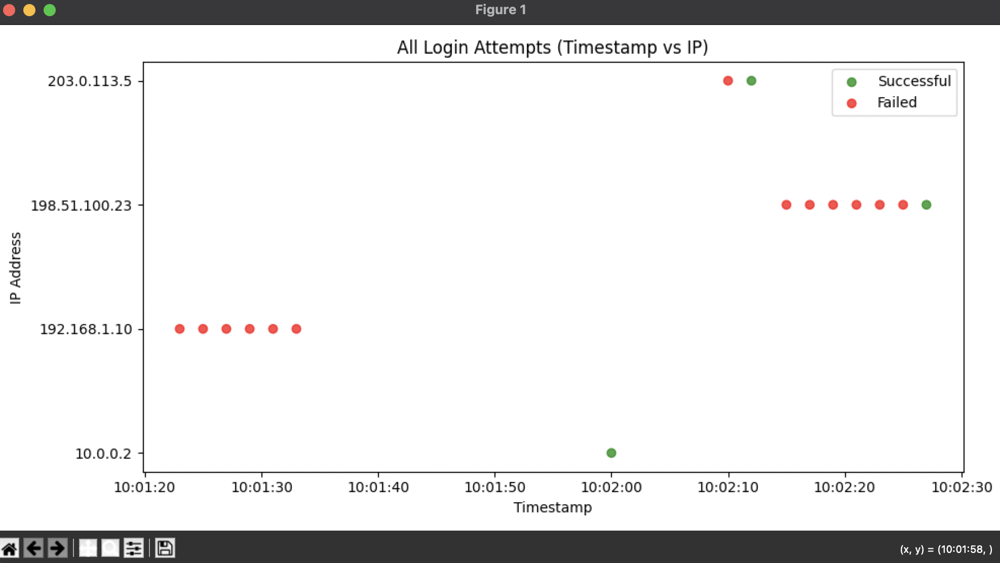

# Authentication Log Analyzer

A Python tool to analyze Linux authentication logs, detect suspicious activity, and visualize login attempts. Features both a command-line and a user-friendly GUI.

## Features
- Parse Linux authentication logs (e.g., `/var/log/auth.log`)
- Detect failed and successful login attempts
- Identify suspicious IPs with multiple failures (brute-force detection)
- View login summaries in tables (Failed, Successful, Suspicious IPs)
- Visualize failed, successful, suspicious, or all login attempts with graphs
- Export results as CSV for reporting (including all attempts with timestamp, IP, and status)

## Screenshots

### Home Page


### Report View


### Visualization



## Requirements
- Python 3.7+
- Install dependencies:
  ```bash
  pip install -r requirements.txt
  ```

## Usage

### Command-Line Mode
Analyze a log file and print the report in the terminal:
```bash
python main.py /path/to/auth.log
```

### GUI Mode
Launch the graphical interface:
```bash
python main.py --gui
```
- Click **Select Log File** to choose a log file (e.g., `sample_auth.log`).
- View the analysis report and login summaries in tabs.
- Use the dropdown to visualize failed, successful, suspicious, or all login attempts.
- Use the export dropdown to save any summary or all attempts as a CSV file.

## Example
- A sample log file (`sample_auth.log`) is included for testing.

## Notes
- The tool works on macOS, Linux, and Windows.
- For best results, run as a user with permission to read the log files.

## License
MIT License
